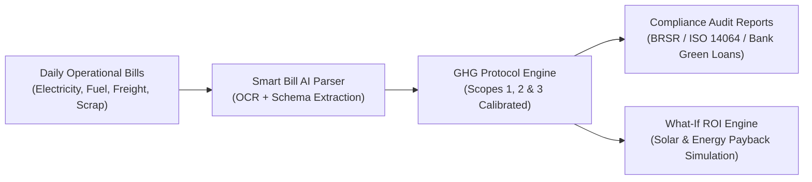
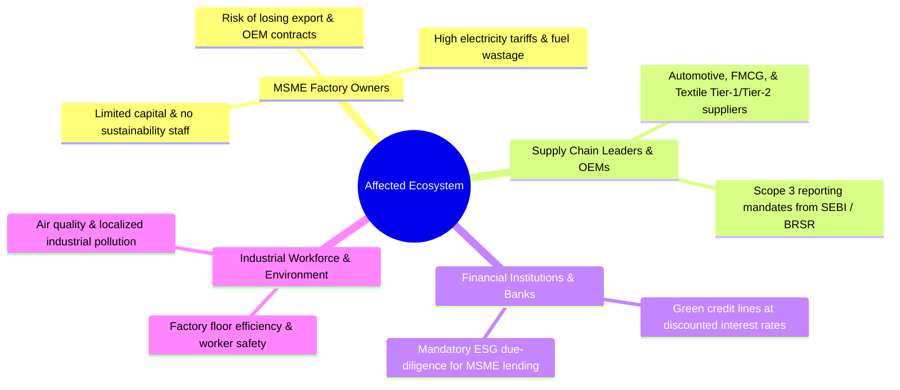
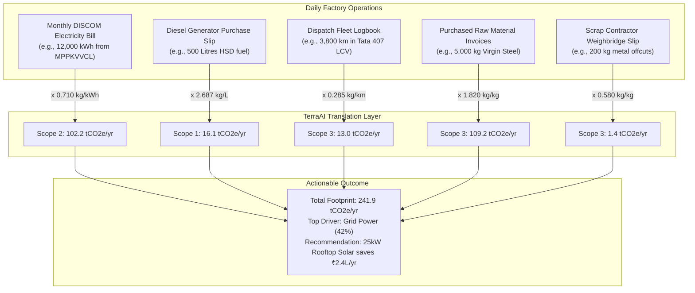

# TerraAI: Democratizing Carbon Intelligence for MSMEs
### *A Practical, Data-Driven Decarbonization Framework for Small & Medium Enterprises*

---

## 1. Executive Summary & The Solution in General

### The Problem
Global climate regulations, corporate supply-chain mandates (BRSR in India, EU CBAM, Scope 3 ESG audits), and rising industrial energy tariffs have created an existential compliance and cost burden for Micro, Small, and Medium Enterprises (MSMEs). Large enterprises hire top-tier ESG consulting firms costing ₹10L–₹50L annually, but MSMEs lack dedicated sustainability officers, technical expertise, and surplus capital.

### The Solution: TerraAI
**TerraAI** is an automated, AI-driven carbon footprint accounting and decarbonization intelligence platform engineered specifically for industrial MSMEs. 

Rather than requiring complex Life Cycle Assessments (LCAs) or abstract enterprise carbon software, TerraAI converts **routine operational bills and invoices into certified Scope 1, Scope 2, and Scope 3 greenhouse gas (GHG) emission audits** in minutes. It couples statutory emission factors (CEA v21.0, IPCC, ARAI) with an actionable What-If ROI financial simulator, proving that carbon reduction directly translates to operational cost savings.



---

## 2. Who is Affected?



### 1. MSME Business Owners & Plant Managers
- **Vulnerability:** Facing sudden demands from OEM buyers (e.g., Tata Motors, Maruti, IKEA, Unilever) to disclose Scope 1 & Scope 2 emission footprints or face supplier disqualification.
- **Financial strain:** Escalating industrial electricity tariffs (₹7.50–₹11.00/kWh) and diesel generator runtime during grid fluctuations.

### 2. Tier-1 & Tier-2 Supply Chain Anchors
- Large corporate buyers are legally mandated to report their **Scope 3 (value chain) emissions**. Because 60%–80% of an OEM's total carbon footprint originates in Tier-2/Tier-3 MSME supplier facilities, OEMs must either measure their suppliers or replace them with green-certified competitors.

### 3. Commercial Banks & Green Financing Bodies
- Under RBI and global ESG frameworks, banks (SBI, SIDBI, HDFC) offer subsidized interest rates (25–75 bps discount) for verified green MSME projects (e.g., rooftop solar, variable frequency drives). However, loans stall because MSMEs cannot provide audit-grade baseline data.

### 4. Regulatory & Export Bodies
- **European Union CBAM (Carbon Border Adjustment Mechanism):** Imposes import carbon taxes on steel, aluminum, and manufacturing exports unless accompanied by verified carbon accounting.

---

## 3. Why the Need Exists Specifically in Small Businesses

Enterprise software (SAP Sustainability, Persefoni, Watershed) is engineered for Fortune 500 corporations with six-figure budgets, multidisciplinary ESG committees, and cloud ERPs. 

Small businesses operate on completely different ground realities:

| Enterprise Reality | MSME Reality | How TerraAI Solves It |
| :--- | :--- | :--- |
| Dedicated Chief Sustainability Officer (CSO) | Factory owner handles production, sales & compliance | **Zero ESG jargon:** Plain-English, step-by-step inputs |
| Centralized SAP / Oracle ERP data pipelines | Paper invoices, WhatsApp PDFs, ledger logbooks | **AI OCR:** Drag-and-drop bill parser |
| ₹15 Lakhs+ software license & annual consulting fees | Thin profit margins (4%–10% EBITDA) | **Free / Micro-SaaS pricing** accessible to any workshop |
| Carbon reporting as corporate PR / CSR exercise | Survival, cost reduction, and customer retention | **Direct ROI focus:** Every ton of CO₂ saved is money saved |

> [!IMPORTANT]
> **MSMEs do not buy "sustainability" — they buy operational efficiency, cost reduction, and contract protection.** TerraAI frames carbon reduction through the lens of unit economics and utility savings.

---

## 4. Tangible Benefits for MSMEs

### 1. Direct Cash Savings & Energy Bill Reduction
- Identifying energy leakages, low power factors, and idling DG sets typically yields **12%–22% immediate utility bill reductions**.
- Built-in Solar & VFD Payback Calculator demonstrates exact months to break-even.

### 2. Export & OEM Supply Chain Retention
- Generates 1-click **BRSR / GHG Protocol Scope 1-2-3 compliance certificates** that satisfy vendor onboarding questionnaires of multinational corporations.

### 3. Cheaper Capital & Priority Green Lending
- Verified footprint summaries qualify small plants for **SIDBI Green Loans, 4E financing, and interest subvention schemes**.

### 4. Frictionless Onboarding
- Instant guest access via **Temporary MSME Session IDs** allows plant managers to generate a full baseline report before signing up.

---

## 5. Feasibility & Viability Analysis

```
+-------------------------------------------------------------------------------+
|                             FEASIBILITY MATRIX                                |
+------------------------------------+------------------------------------------+
| Technical Feasibility (9.5/10)     | Operational Viability (9.0/10)           |
| • Lightweight Vite + React UI      | • Zero operational disruption            |
| • Python FastAPI calculation core  | • Less than 5 minutes to run an audit    |
| • Statutory CEA / IPCC factors     | • Works with standard paper utility bills|
+------------------------------------+------------------------------------------+
| Economic Viability (9.8/10)        | Statutory & Compliance Accuracy (9.5/10) |
| • Serverless architecture          | • Aligned with GHG Protocol Corporate    |
| • Negligible infra compute cost    | • Calibrated with CEA User Guide v21.0   |
| • High ROI for end-user MSME       | • Exportable CSV / Excel / PDF dossiers  |
+------------------------------------+------------------------------------------+
```

### Technical Feasibility
- **Zero-Install Web App:** Accessible from any shop-floor mobile phone, tablet, or desktop browser.
- **FastAPI Calculation Microservice:** Sub-50ms deterministic calculation response based on published empirical emission factors.

### Operational Feasibility
- Does not require IoT hardware or smart telemetry sensors. Utilizes existing administrative utility documentation already generated monthly for accounting and GST filings.

### Commercial Viability
- Cloud inference costs per bill extraction are fractions of a rupee, enabling profitable freemium and affordable tiered subscription models.

---

## 6. Unique Selling Proposition (USP)

```
                            [ TerraAI Unique Advantages ]
                                         |
     +-------------------+---------------+-------------------+
     |                   |                                   |
     v                   v                                   v
[ Smart Bill OCR ]  [ Statutory India Factors ]     [ Financial ROI Engine ]
Auto-extracts kWh,   Pre-configured CEA Grid         Converts tCO2e reduction
Litres & km from     (0.710 kg/kWh), ARAI, and       into ₹ annual savings &
utility invoices.    CPCB baseline coefficients.     solar payback periods.
```

1. **OCR-Powered Document Extraction:** MSMEs simply upload their DISCOM power bill or fuel receipt; the system extracts units, billing cycle, and tariff details automatically.
2. **India-Specific Statutory Calibration:** Pre-configured with official Indian emission factors (**CEA Baseline Database v21.0 at 0.710 kg CO₂e/kWh**, IPCC fuel densities, CPCB waste standards).
3. **No-Sign-Up Temporary ID Sandbox:** Immediate value demonstration without forced credential walls.
4. **Actionable ROI What-If Simulator:** Translates abstract emissions (tCO₂e) into tangible financial outcomes (₹ saved per year, IRR, and payback in years).

---

## 7. Relatability with Daily Operational Data

The reason traditional carbon tools fail in small factories is that they ask questions like:
> *"What is your Scope 1 fugitive emission mass balance in metric tons of CH4 equivalent?"*

TerraAI asks the questions the plant accountant and maintenance supervisor already know:



### Relatability Mapping:
1. **Electricity (Scope 2):** From the monthly electricity bill -> kWh units & bill period.
2. **Fuel & Generators (Scope 1):** From the diesel/petrol pump slip or tanker invoice -> Litres.
3. **Transport & Logistics (Scope 3):** From the delivery trip sheet or transporter invoice -> Distance in km & vehicle type.
4. **Raw Materials (Scope 3):** From vendor GST invoices -> Weight in kg/tonnes.
5. **Waste Management (Scope 3):** From scrap disposal gate passes -> Waste type & quantity.

---

## 8. Summary & Strategic Impact

TerraAI closes the gap between global decarbonization mandates and small factory economics. By turning daily utility receipts into boardroom-ready carbon audits and high-ROI efficiency plans, TerraAI empowers MSMEs to protect their customer relationships, access discounted green capital, and systematically reduce their operational overhead.
